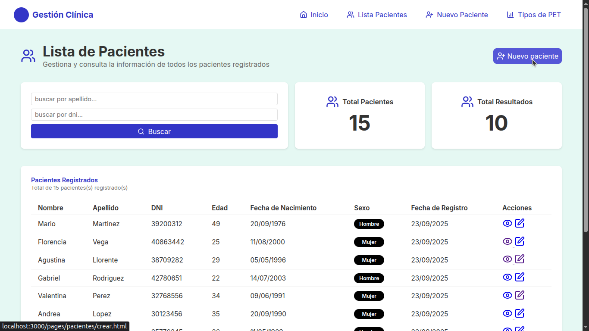

# Prueba Técnica: Herramienta de Gestión para Clínica

Este proyecto es una herramienta web para gestionar pacientes y tratamientos médicos de un equipo llamado "PET", desarrollada para la prueba técnica de Integrando Salud. Su propósito es demostrar las habilidades en desarrollo full-stack, con un enfoque en la claridad, organización del código y funcionalidad.

El sistema está dividido en /backend (Construido con php y Laravel), el /frontend (Construido con html, css y javascript) y la base de datos utilizada es MySQL.

¿Por qué con Docker/Docker Compose? Se construyó el sistema con la idea de poder distribuirlo fácilmente con contenedores para evitar problemas de versiones y de configuración. 

Se maquetó el sistema pensando en un dashboard moderno y fácil de utilizar.



### Índice

* 💻 [Requisitos del Sistema](#-requisitos-del-sistema)
* 🛠️ [Instalación y Configuración](#️-instalación-y-configuración)
* 📁 [Estructura de Carpetas](#-estructura-de-carpetas)
* 🚀 [Tecnologías Utilizadas](#-tecnologías-utilizadas)
* ✨ [Funcionalidades Implementadas](#-funcionalidades-implementadas)
* 🛑 [Detener los Contenedores](#-detener-los-contenedores)
* 📧 [Contacto](#-contacto)
  
---

### 💻 Requisitos del Sistema

Para poder ejecutar esta aplicación, necesitarás los siguientes componentes instalados en tu sistema:

* **[Docker](https://www.docker.com/) y [Docker Compose](https://docs.docker.com/compose/)**: El proyecto se ejecuta en contenedores. El archivo `docker-compose.yml` se encarga de construir la imagen de Laravel y de levantar el servidor web y la base de datos MySQL.
* **[Node.js](https://nodejs.org/es) y [npm](https://docs.npmjs.com/downloading-and-installing-node-js-and-npm)**: Se necesita una versión reciente de Node.js (20 o superior es recomendable) para instalar y ejecutar el servidor web del frontend, ya que se usa `npx http-server`.

---

### 🛠️ Instalación y Configuración

1.  **Clonar el repositorio**:
    ```bash
    git clone https://github.com/JavierPineyro/integrando-salud-prueba-tecnica.git
    cd integrando-salud-prueba-tecnica
    ```

2.  **Levantar los contenedores**:
    * Desde la raíz del proyecto, ejecuta el siguiente comando para construir las imágenes de Docker y levantar los contenedores del backend y la base de datos:
        ```bash
        docker-compose up -d --build
        ```
    * Si encuentras problemas de permisos, prueba con `sudo docker-compose up -d --build`.

3.  **Verificar el estado de la base de datos**:
    * Es importante esperar a que la base de datos se configure por completo. Este proceso puede tardar entre 3 y 4 minutos. Puedes verificar su estado ejecutando:
        ```bash
        docker-compose ps
        ```
    * La base de datos estará lista cuando el estado de su contenedor muestre **(healthy)**. Si dice `(starting...)` o `(health: starting)`, debes seguir esperando.

4.  **Ejecutar las migraciones de la base de datos**:
    * Una vez que la base de datos esté disponible (Deja unos segundos más por si acaso), accede al contenedor del backend y ejecuta las migraciones para crear las tablas y poblar la base de datos con datos de prueba:
        ```bash
        docker-compose exec backend php artisan migrate --seed
        ```
    * **Nota**: Si te falla la migración solo vuelve a intentarlo unos segundos después.
 
5.  **Levantar el servidor del frontend**:
    * Accede a la carpeta del frontend y levanta el servidor HTTP.
        ```bash
        cd frontend
        npm start     
        ```
    * **Nota**: Al ser un frontend con HTML, CSS y JavaScript puros, no se requiere instalación de dependencias, pero sí se necesita un servidor HTTP para evitar problemas de CORS y acceso a archivos.

6.  **Acceder a la aplicación**:
    * La aplicación estará disponible en `http://localhost:3000` (o el puerto que te indique `http-server`).

---

### 📁 Estructura de Carpetas

```bash
integrando-salud-prueba-tecnica/
├── backend/                  # Proyecto Laravel
│   ├── ...
├── docker-compose.yml
├── frontend/
│   ├── src/                  # Archivos fuente del frontend
│   │   ├── assets/
│   │   ├── pages/
│   │   └── index.html
│   ├── package.json
│   └── README.md
└── README.md
```

---

### 🚀 Tecnologías Utilizadas

* **Backend**: PHP 8.3.6 y Laravel.
* **Frontend**: HTML, CSS y JavaScript puros.
* **Base de Datos**: MySQL.
* **Contenedores**: Docker.
* **Servidor Frontend**: `http-server`.
### Bibliotecas Utilizadas
* **Validaciones**: [Zod](https://zod.dev/).
* **Notificaciones**: [Toaster UI](https://toster-js.vercel.app/).
---

### ✨ Funcionalidades Implementadas

* **Gestión de Pacientes**:
    * Alta, modificación y listado de pacientes.
    * Formulario para registrar y editar pacientes.
    * Listado de pacientes en una tabla, con filtro por apellido o DNI.
* **Gestión de Tipos de PET**:
    * Alta, baja, modificación y listado de tipos de PET.
    * Formulario para registrar nombre descriptivo, color, intensidad, duración, ayuno y observaciones.
    * Listado que permite ver los tipos de pet activos por defecto y también los inactivos.
* **Gestión de Tratamientos**:
    * Desde el listado de pacientes, se puede acceder al listado de tratamientos de un paciente.
    * El listado de tratamientos muestra el historial de tratamientos.
    * Botón para agregar nuevos tratamientos.
    * Formulario para cargar un tratamiento, permitiendo seleccionar un tipo de pet activo y la fecha de inicio.

---

### 🛑 Detener los Contenedores

Una vez que hayas terminado de usar la aplicación, puedes detener los contenedores y limpiar los recursos.

* Para detener los contenedores sin eliminar los datos de la base de datos, navega a la raíz del proyecto y ejecuta:
    ```bash
    docker-compose down
    ```
    Con este comando, los datos de la base de datos persisten, lo que te permite volver a levantar los servicios más tarde con `docker-compose up -d`.

* Para detener y eliminar completamente los contenedores, las redes y los volúmenes con los datos de la base de datos, usa la siguiente opción:
    ```bash
    docker-compose down -v
    ```
    La opción `-v` es crucial porque elimina los volúmenes de datos. Si usas este comando y luego quieres volver a levantar la aplicación, tendrás que repetir todos los pasos de instalación, incluyendo las migraciones y los `seeders`, para recrear las tablas y los datos.

### 📧 Contacto

Para cualquier consulta o duda sobre el proyecto, no dudes en contactarme.
**Dario Javier Piñeyro**


### EXTRAS
TODO: TAREAS REALIZADAS

## Pacientes
[x] maquetar listar pacientes page

[x] hidratar página pacientes page

[x] maquetar formulario de crear paciente

[x] hidratar formulario crear paciente

[x] maquetar formulario editar paciente

[x] hidratar formulario editar paciente

[x] agregar que show endpoint devuelva al paciente Y sus tratamientos

[x] maquetar pagína info paciente

## Pets

[x] maquetar listar pets page

[x] hidratar página pets page

[x] hacer funcionar el boton de activo en tabla pets

[x] agregar el contador de pets activos/inactivos de listar pets tabla

[x] maquetar formulario de crear pet

[x] hidratar formulario de crear pet

[x] maquetar formulario de editar pet

[x] hidratar formulario de editar pet

## Tratamiento

[x] maquetar formulario de crear Tratamiento

[x] agregar iconos en donde corresponden

[x] agregar Toaster Ui?

[x] agregar loader y desabilitar botones en editar forms?
## Agregar el Service en el backend
[x] Testear los contenedores del backend de compose
[x] Agregar los servicios para abstraer logica de los controllers
[x] Agregar README con pasos del servidor


